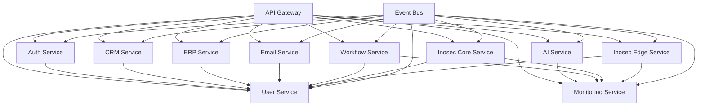

# Backend Services Overview

This directory contains all microservices that power the Inopsio multi-tenant SaaS platform. Each service is designed with clear separation of concerns, independent deployment capabilities, and comprehensive monitoring.

## Architecture Overview

The backend follows a microservices architecture pattern with the following key principles:
- **Service Independence**: Each service can be developed, deployed, and scaled independently
- **API-First Design**: All services expose well-defined REST and GraphQL APIs
- **Event-Driven Communication**: Services communicate through events and message queues
- **Shared Infrastructure**: Common concerns like authentication, monitoring, and logging are centralized

## Service Dependencies



## Core Services

### Authentication & Authorization
- **Auth Service**: OAuth2/OpenID Connect, JWT tokens, MFA, SAML integration
- **User Service**: User profiles, preferences, account management

### Business Applications
- **CRM Service**: Lead management, contact management, sales pipeline
- **ERP Service**: Inventory, orders, financial management, supplier management
- **Email Service**: Email templates, queuing, marketing automation, analytics

### AI & Automation
- **AI Service**: Model management, data processing, inference engine, MLOps
- **Workflow Service**: Process definition, execution engine, task management

### Cybersecurity Platform
- **Inosec Core Service**: Threat detection, security analytics, incident response
- **Inosec Edge Service**: Edge device management, data collection, local analytics

### Infrastructure
- **Monitoring Service**: Metrics collection, alerting, dashboards, health checks
- **Gateway**: API routing, authentication, rate limiting, transformation

## Shared Components

### `/backend/shared/`
Common utilities, data models, validation, and testing frameworks used across all services.

### `/backend/events/`
Event-driven architecture components including event publishing, subscribing, schema definition, and dead letter queues.

### `/backend/jobs/`
Background job processing and task scheduling for distributed job execution and management.

### `/backend/scripts/`
Database migrations, system administration, data seeding, and backup/restore procedures.

## Development Guidelines

### Service Development
1. **API Design**: Follow OpenAPI 3.0 specifications
2. **Database**: Each service manages its own database
3. **Testing**: Comprehensive unit, integration, and contract testing
4. **Documentation**: Service-specific README with API documentation

### Inter-Service Communication
1. **Synchronous**: REST APIs for real-time operations
2. **Asynchronous**: Event-driven communication for non-critical operations
3. **Data Consistency**: Eventual consistency with compensation patterns

### Monitoring & Observability
- **Metrics**: Prometheus metrics for each service
- **Logging**: Structured logging with correlation IDs
- **Tracing**: Distributed tracing across service boundaries
- **Health Checks**: Kubernetes-ready health check endpoints

## Deployment

### Local Development
```bash
# Start all services
make dev

# Start specific service
make dev SERVICE=auth-service

# Run tests
make test

# Run linting
make lint
```

### Production Deployment
- **Containerization**: Each service has its own Dockerfile
- **Orchestration**: Kubernetes deployment with Helm charts
- **Configuration**: Environment-specific configuration management
- **Secrets**: HashiCorp Vault integration for secret management

## Security

### Authentication Flow
1. User authenticates through Auth Service
2. JWT token issued with tenant and role information
3. Gateway validates tokens for all API requests
4. Services use token claims for authorization decisions

### Data Isolation
- **Tenant Isolation**: Database-level tenant separation
- **Row-Level Security**: Database policies for tenant data access
- **API Security**: Rate limiting, input validation, and sanitization

## Monitoring & Alerting

### Service Health
- **Health Endpoints**: `/health` and `/ready` endpoints for each service
- **Dependency Checks**: Database, cache, and external service connectivity
- **Performance Metrics**: Response times, throughput, and error rates

### Alerting Rules
- **Service Down**: Immediate alert when service is unreachable
- **High Error Rate**: Alert when error rate exceeds threshold
- **Performance Degradation**: Alert on response time increases
- **Resource Usage**: Alert on high CPU, memory, or disk usage

## Documentation

Each service contains:
- **README.md**: Service overview, setup, and API documentation
- **API Specs**: OpenAPI specifications for all endpoints
- **Architecture**: Service-specific architecture diagrams
- **Monitoring**: Prometheus rules and Grafana dashboards

## Getting Started

1. **Prerequisites**: Docker, Node.js, Python, Go (see root README for versions)
2. **Environment Setup**: Copy `.env.example` to `.env.local`
3. **Database Setup**: Run `make db-setup` for initial database setup
4. **Service Development**: Use `make dev` to start all services
5. **API Testing**: Use provided Postman collections or API documentation

For detailed service-specific documentation, see individual service README files.
