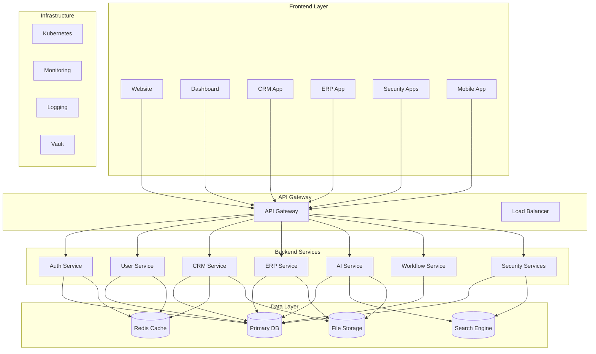
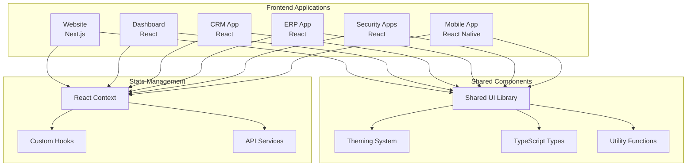
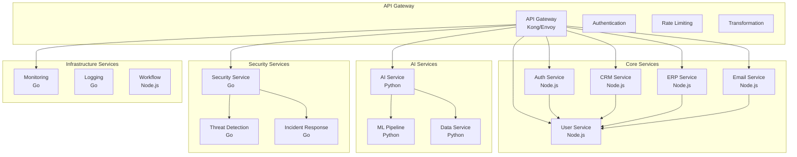
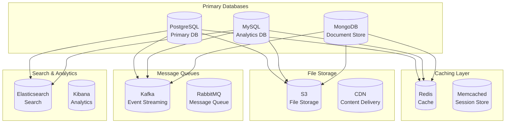
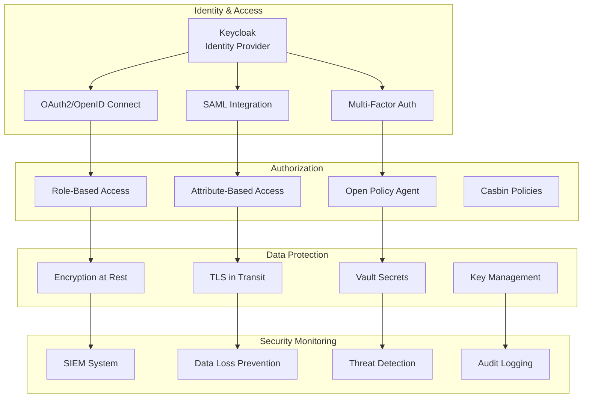
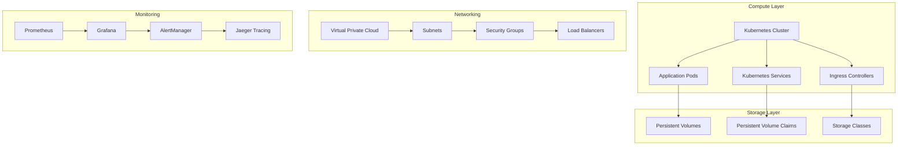
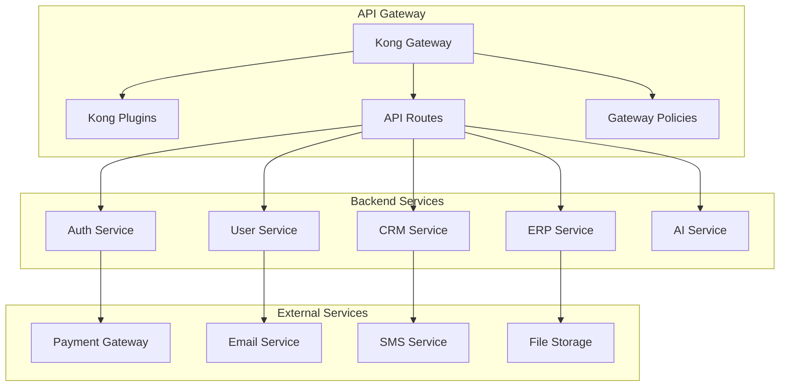

# Architecture Components Overview

This document provides a comprehensive overview of all architectural components, their relationships, and visual representations within the Inopsio platform.

## Component Categories

### Core Platform Components
- **Frontend Applications**: User interfaces and dashboards
- **Backend Services**: Microservices and API layer
- **Data Layer**: Databases and data storage
- **Infrastructure**: Cloud infrastructure and orchestration

### Security Components
- **Authentication**: Identity and access management
- **Authorization**: Role-based access control
- **Encryption**: Data protection and security
- **Monitoring**: Security monitoring and alerting

### Integration Components
- **API Gateway**: Request routing and management
- **Message Bus**: Event-driven communication
- **External APIs**: Third-party integrations
- **Data Pipelines**: Data processing and transformation

## System Architecture Diagram

### High-Level Architecture

## Frontend Components

### Application Architecture

### Component Hierarchy
- **Layout Components**: Page layouts and navigation
- **UI Components**: Reusable UI elements
- **Business Components**: Domain-specific components
- **Integration Components**: API and service integration

## Backend Components

### Microservices Architecture

### Service Dependencies
- **Authentication**: Centralized auth for all services
- **User Management**: User data and preferences
- **Business Logic**: Domain-specific business services
- **AI/ML**: Artificial intelligence and machine learning
- **Security**: Cybersecurity and threat detection
- **Infrastructure**: Monitoring, logging, and orchestration

## Data Architecture

### Data Layer Components

### Data Flow Patterns
- **Transactional Data**: ACID-compliant relational databases
- **Analytical Data**: Columnar storage for analytics
- **Document Data**: NoSQL for flexible schemas
- **Cached Data**: High-performance caching layer
- **Search Data**: Full-text search and analytics
- **File Data**: Object storage for files and media

## Security Architecture

### Security Components

### Security Layers
- **Network Security**: Firewalls, VPNs, and network segmentation
- **Application Security**: Secure coding, input validation, and authentication
- **Data Security**: Encryption, access controls, and data classification
- **Operational Security**: Monitoring, incident response, and compliance

## Infrastructure Components

### Cloud Infrastructure

### Infrastructure Patterns
- **Container Orchestration**: Kubernetes for container management
- **Service Mesh**: Istio for service-to-service communication
- **Monitoring Stack**: Prometheus, Grafana, and Jaeger
- **Logging Stack**: ELK (Elasticsearch, Logstash, Kibana)
- **CI/CD Pipeline**: GitLab CI/CD or GitHub Actions

## Integration Components

### API Gateway Architecture

### Integration Patterns
- **API Gateway**: Centralized API management and routing
- **Service Discovery**: Dynamic service registration and discovery
- **Circuit Breaker**: Fault tolerance and resilience patterns
- **Rate Limiting**: API throttling and usage control
- **Transformation**: Request/response transformation and validation

## Component Relationships

### Dependency Matrix
| Component | Dependencies | Dependents |
|-----------|-------------|------------|
| API Gateway | Load Balancer | All Services |
| Auth Service | Database, Cache | All Services |
| User Service | Database, Cache | CRM, ERP, Security |
| CRM Service | Database, Cache, User | Dashboard, Mobile |
| ERP Service | Database, Cache, User | Dashboard, Mobile |
| AI Service | Database, ML Pipeline | Dashboard, Workflow |
| Security Service | Database, Threat Detection | Dashboard, Mobile |
| Monitoring Service | All Services | Operations Team |

### Communication Patterns
- **Synchronous**: REST APIs for real-time operations
- **Asynchronous**: Message queues for event-driven communication
- **Streaming**: Real-time data streaming for analytics
- **Batch Processing**: Scheduled batch jobs for data processing

## Best Practices

### Component Design
- **Single Responsibility**: Each component has a single, well-defined purpose
- **Loose Coupling**: Minimize dependencies between components
- **High Cohesion**: Related functionality grouped together
- **Interface Segregation**: Small, focused interfaces

### Documentation
- **Component Diagrams**: Visual representation of component relationships
- **API Documentation**: Comprehensive API documentation
- **Architecture Decision Records**: Document architectural decisions
- **Operational Runbooks**: Operational procedures and troubleshooting

## Getting Started

1. **Understand Components**: Review all component documentation
2. **Study Relationships**: Understand component dependencies
3. **Follow Patterns**: Use established architectural patterns
4. **Document Changes**: Document any architectural changes
5. **Review Regularly**: Regular architecture reviews and updates

For detailed component documentation, see the individual component files and API specifications.
