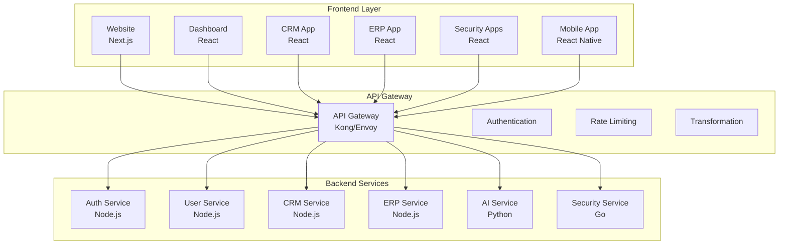
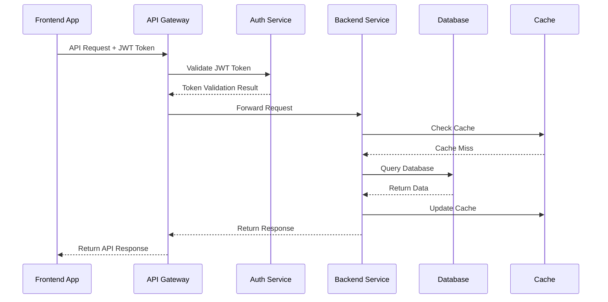
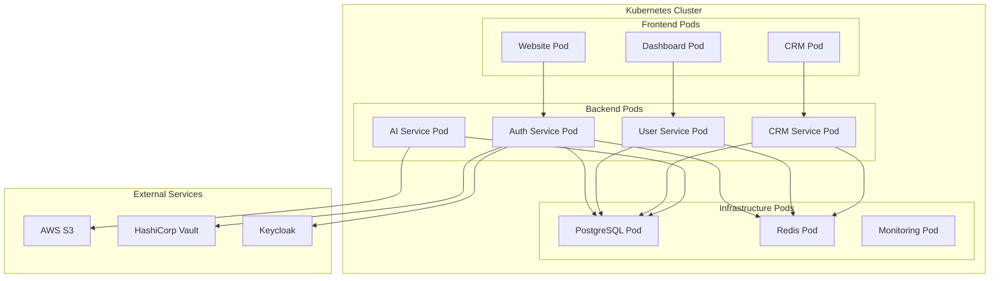
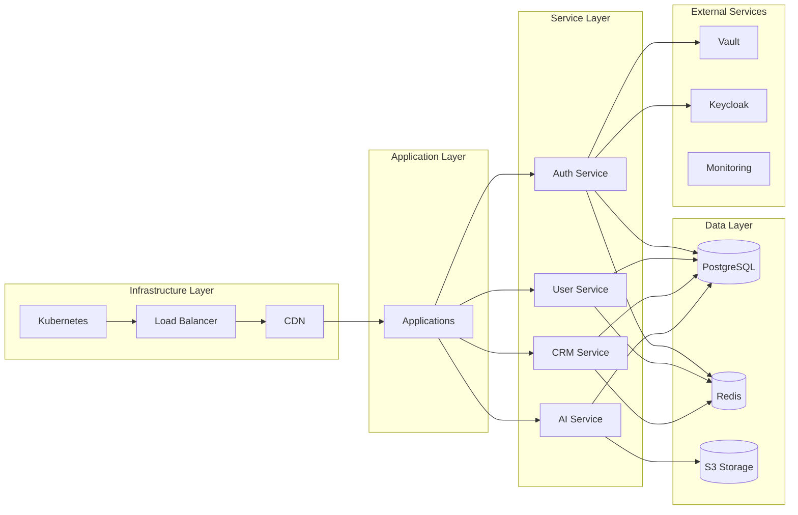
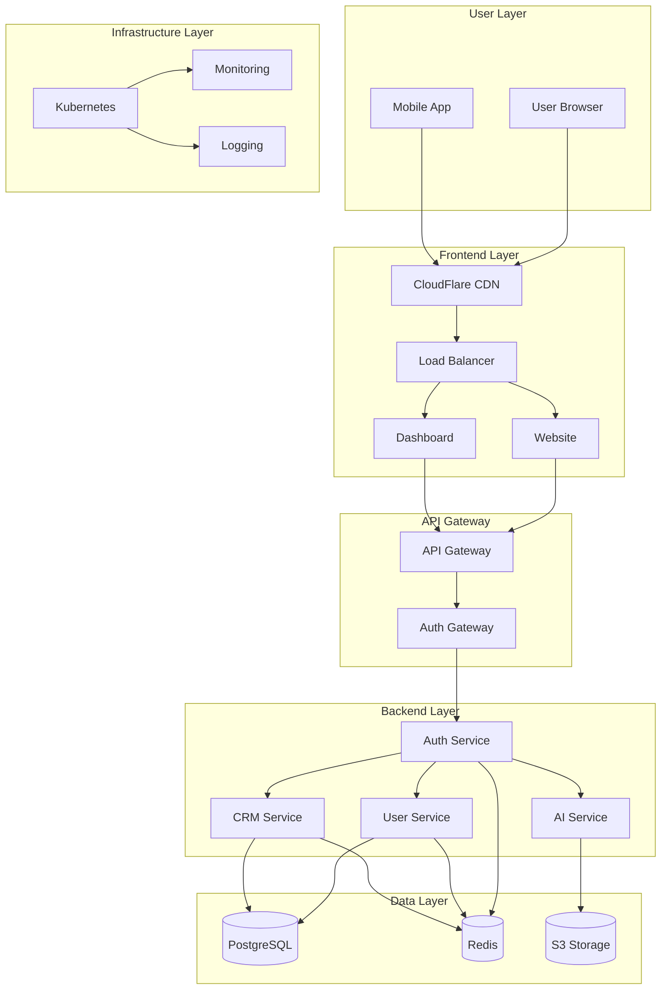
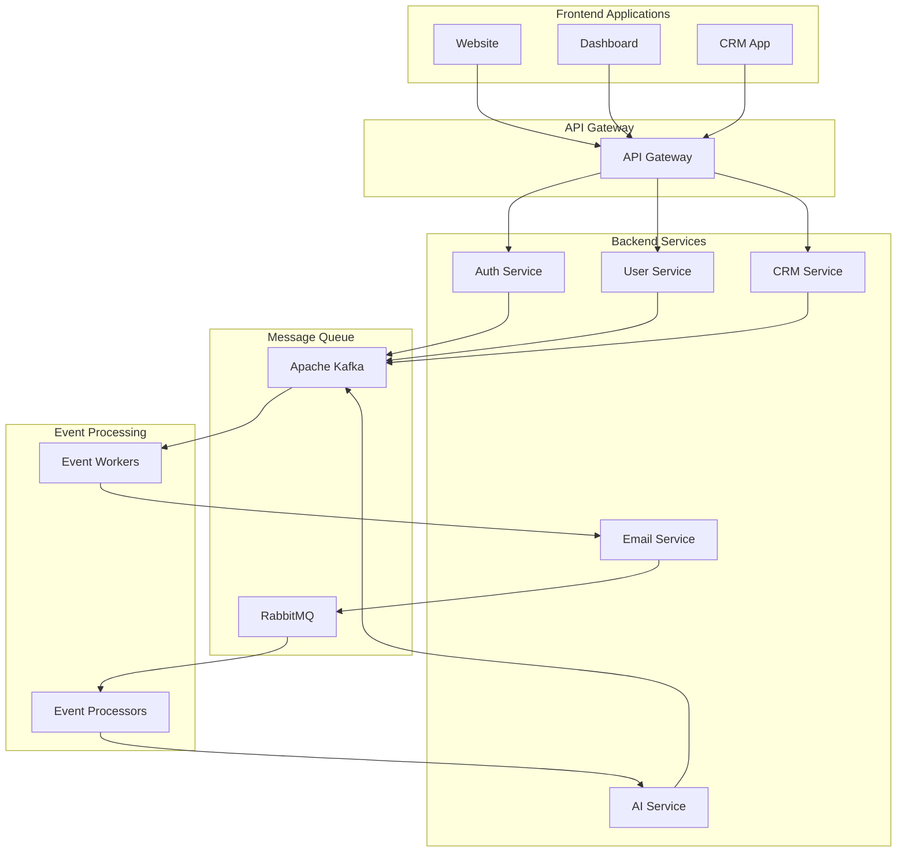
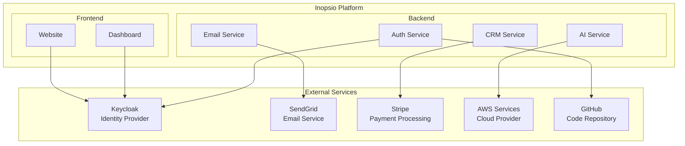
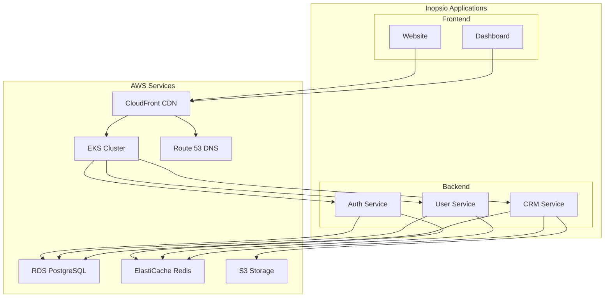
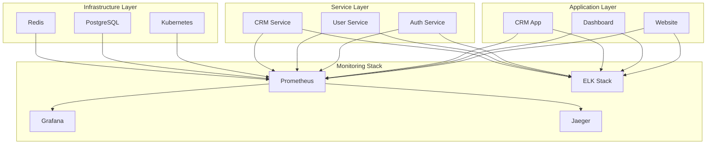
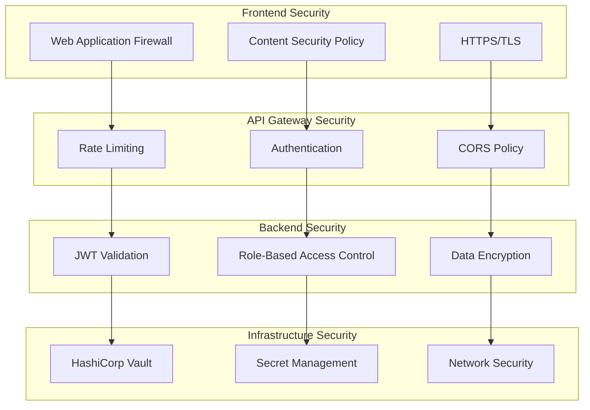

# Integration Diagrams

This directory contains comprehensive integration diagrams that bridge Frontend ↔ Backend ↔ Infrastructure layers, helping new engineers understand the complete system topology.

## Diagram Categories

### System Integration
- **Frontend-Backend Integration**: API communication patterns and data flow
- **Backend-Infrastructure Integration**: Service deployment and infrastructure dependencies
- **Cross-Layer Communication**: End-to-end request flow and data processing
- **External Integrations**: Third-party service integrations and dependencies

### Technology Stack Integration
- **API Gateway Integration**: Request routing and service mesh communication
- **Database Integration**: Data persistence and retrieval patterns
- **Message Queue Integration**: Asynchronous communication and event processing
- **Monitoring Integration**: Observability and alerting across all layers

## Frontend ↔ Backend Integration

### API Communication Flow

### Data Flow Patterns

## Backend ↔ Infrastructure Integration

### Service Deployment Architecture

### Infrastructure Dependencies

## Cross-Layer Communication

### End-to-End Request Flow

### Message Queue Integration

## External Integrations

### Third-Party Service Integration

### Cloud Provider Integration

## Monitoring and Observability Integration

### Cross-Layer Monitoring

## Security Integration

### Security Layer Integration

## Best Practices

### Integration Design
- **Clear Boundaries**: Well-defined interfaces between layers
- **Loose Coupling**: Minimal dependencies between components
- **High Cohesion**: Related functionality grouped together
- **Scalability**: Horizontal scaling capabilities

### Documentation
- **Visual Diagrams**: Clear visual representation of integrations
- **API Documentation**: Comprehensive API documentation
- **Data Flow**: Document data flow between layers
- **Dependencies**: Document all system dependencies

## Getting Started

1. **Understand Architecture**: Review all integration diagrams
2. **Study Dependencies**: Understand system dependencies
3. **Follow Patterns**: Use established integration patterns
4. **Document Changes**: Document any integration changes
5. **Test Integrations**: Test all integration points

For detailed integration documentation, see the individual diagram files and API specifications.
