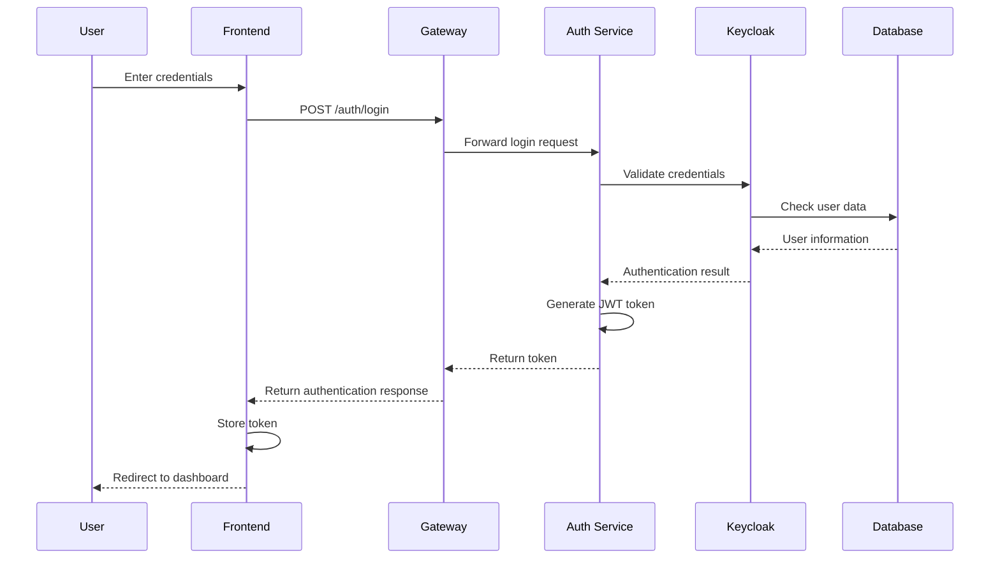
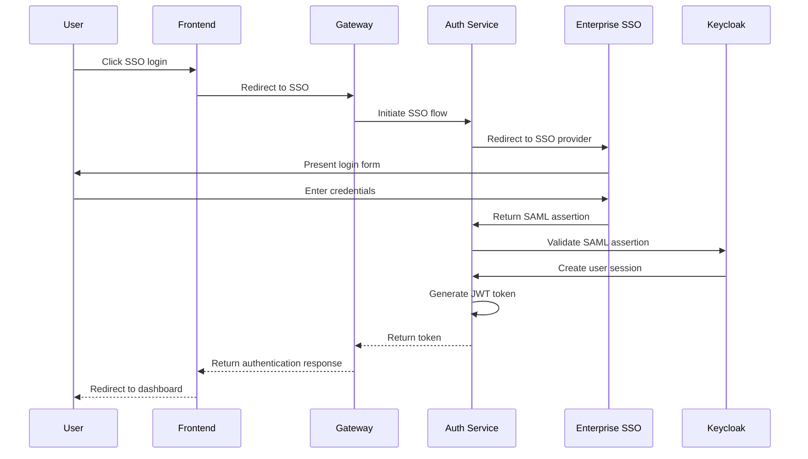
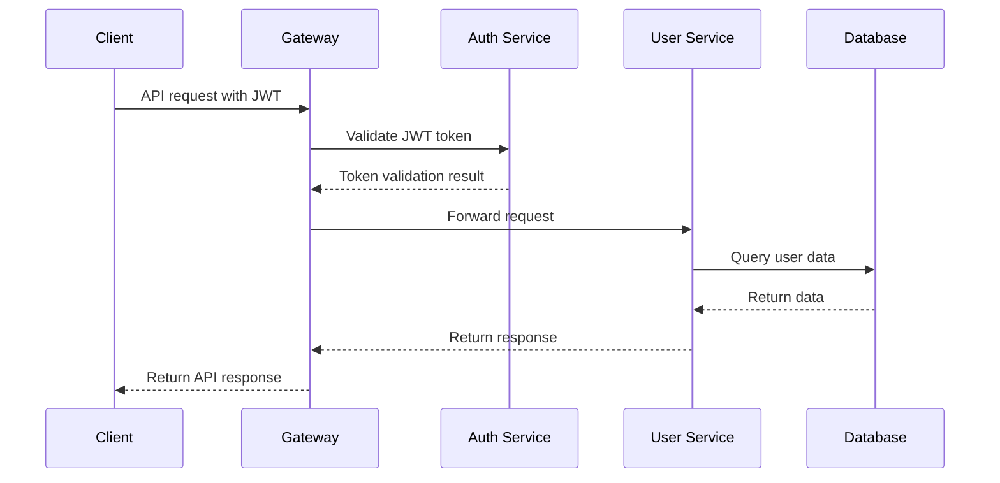
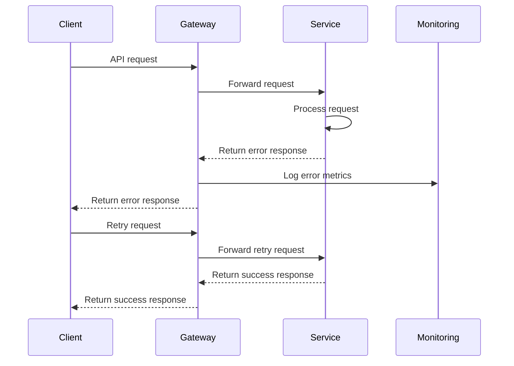
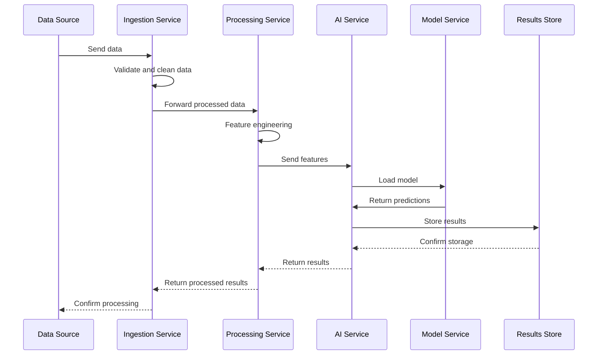
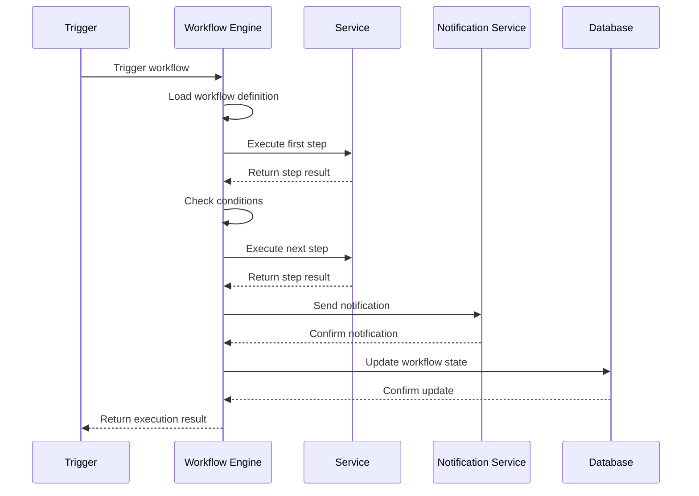
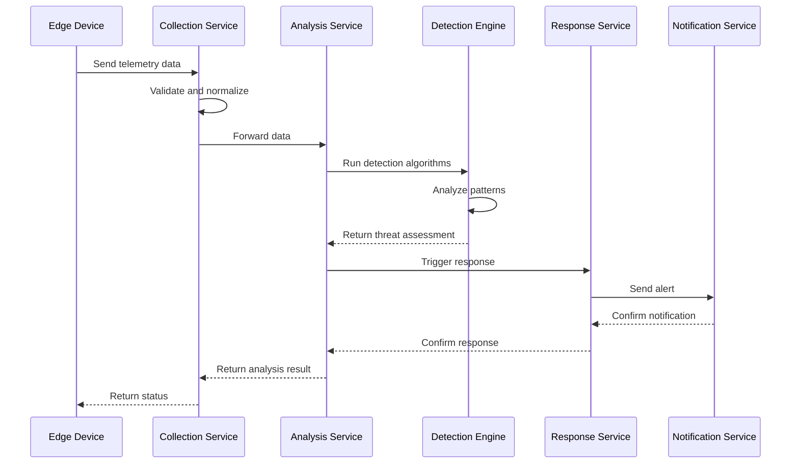
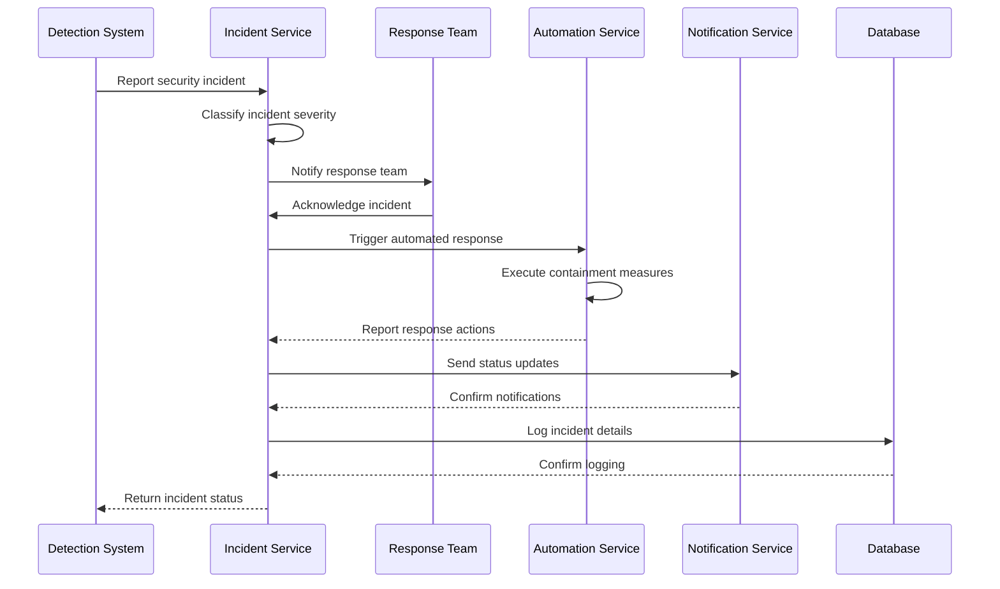
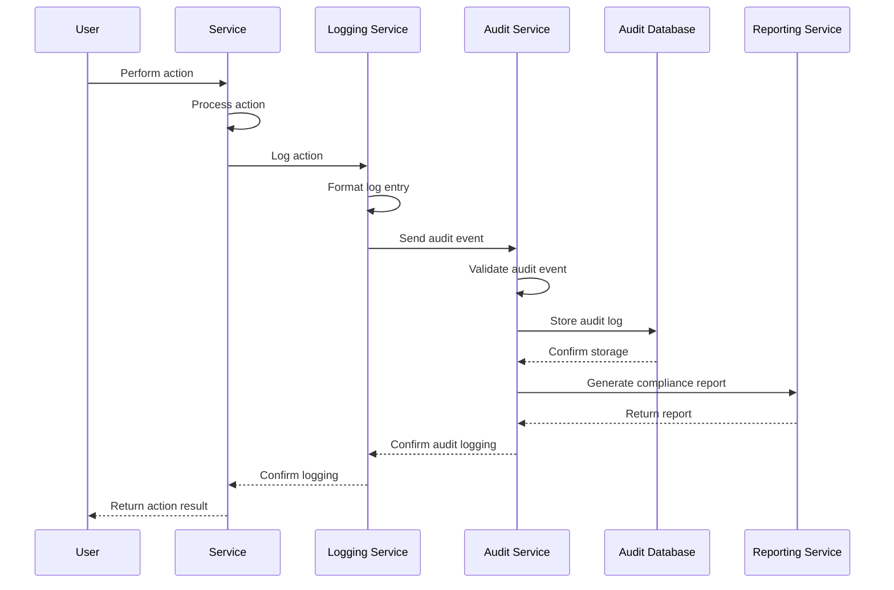
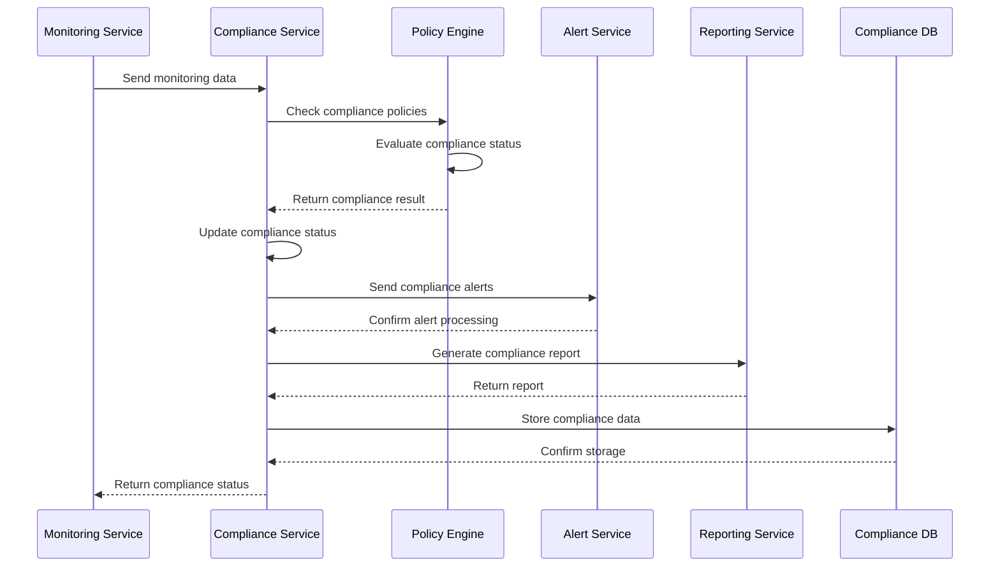

# Sequence Diagrams

This directory contains comprehensive sequence diagrams documenting the data flow, authentication flows, and system interactions within the Inopsio platform.

## Diagram Categories

### Authentication Flows
- **User Login**: Complete user authentication flow
- **SSO Integration**: Single sign-on with enterprise systems
- **MFA Process**: Multi-factor authentication sequence
- **Token Management**: JWT token lifecycle management

### API Interactions
- **Service Communication**: Inter-service API calls
- **Gateway Routing**: API gateway request routing
- **Error Handling**: Error response and retry mechanisms
- **Rate Limiting**: API rate limiting and throttling

### Data Processing
- **Data Ingestion**: Data collection and processing
- **AI Pipeline**: Machine learning model pipeline
- **Workflow Execution**: Business process automation
- **Event Processing**: Event-driven architecture flows

### Security Flows
- **Threat Detection**: Cybersecurity threat detection
- **Incident Response**: Security incident response
- **Compliance Monitoring**: Regulatory compliance checking
- **Audit Logging**: Security audit and logging

## Authentication Flows

### User Login Sequence

### SSO Integration Flow

## API Interactions

### Service Communication

### Error Handling Flow

## Data Processing Flows

### AI Pipeline Sequence

### Workflow Execution

## Security Flows

### Threat Detection Flow

### Incident Response Flow

## Compliance Flows

### Audit Logging Flow

### Compliance Monitoring

## Best Practices

### Diagram Design
- **Clear Labels**: Use descriptive labels for all elements
- **Consistent Style**: Maintain consistent diagram styling
- **Proper Sequencing**: Ensure logical flow sequence
- **Error Handling**: Include error and exception flows

### Documentation
- **Context**: Provide context for each diagram
- **Assumptions**: Document diagram assumptions
- **Updates**: Keep diagrams updated with system changes
- **Version Control**: Version control all diagram files

## Getting Started

1. **Select Tool**: Choose diagramming tool (Mermaid, PlantUML, etc.)
2. **Create Template**: Create diagram templates
3. **Document Flows**: Document all system flows
4. **Review Diagrams**: Review and validate diagrams
5. **Maintain Updates**: Keep diagrams current with system changes

For detailed diagram examples and templates, see the individual diagram files.
